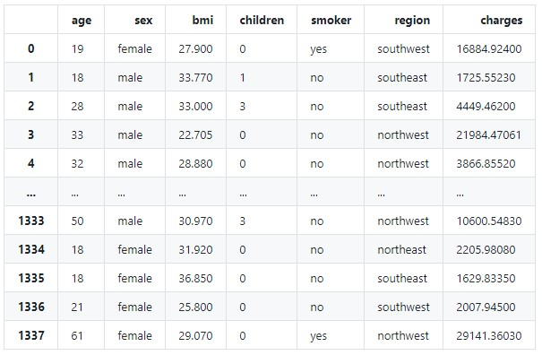

# medical cost predictions

In this notebook try to build a better predicting model to estimate medical cost
of person. in here use linear regression models using ordinary least square, gradient
decent, ridge regularization (L2), lasso regularization (L1), and polynomial methods.

# Dataset
dataset use in here is medical cost prediction dataset from **kaggle**. you can find it from <a href="https://www.kaggle.com/mirichoi0218/insurance">here</a>.

# models

# models performance when normal distribution
1. ***OLS*** - r2_score: 80.939860035233 MSE: 462.49007439686613
2. ***Gradient Descent*** - r2_score: 80.27946220684301 MSE: 478.51448142368764
3. ***Ridge Regression with gradient decent*** - r2_score: 80.63569514256741 MSE: 469.87056814443866
4. ***Lasso Regression with gradient decent*** - r2_score: 80.63580729669192 MSE: 469.86784674944977

# models performance when polynomial distribution
1. ***OLS*** - r2_score: 86.6583090316484 MSE: 20712805.987918362
2. ***Gradient Descent*** - r2_score: 65.83078846556427 MSE: 53047267.46795223
3. ***Ridge Regression with gradient decent*** - r2_score: 80.63569514256741 MSE: 469.87056814443866
4. ***Lasso Regression with gradient decent*** - r2_score: 80.63580729669192 MSE: 469.86784674944977

